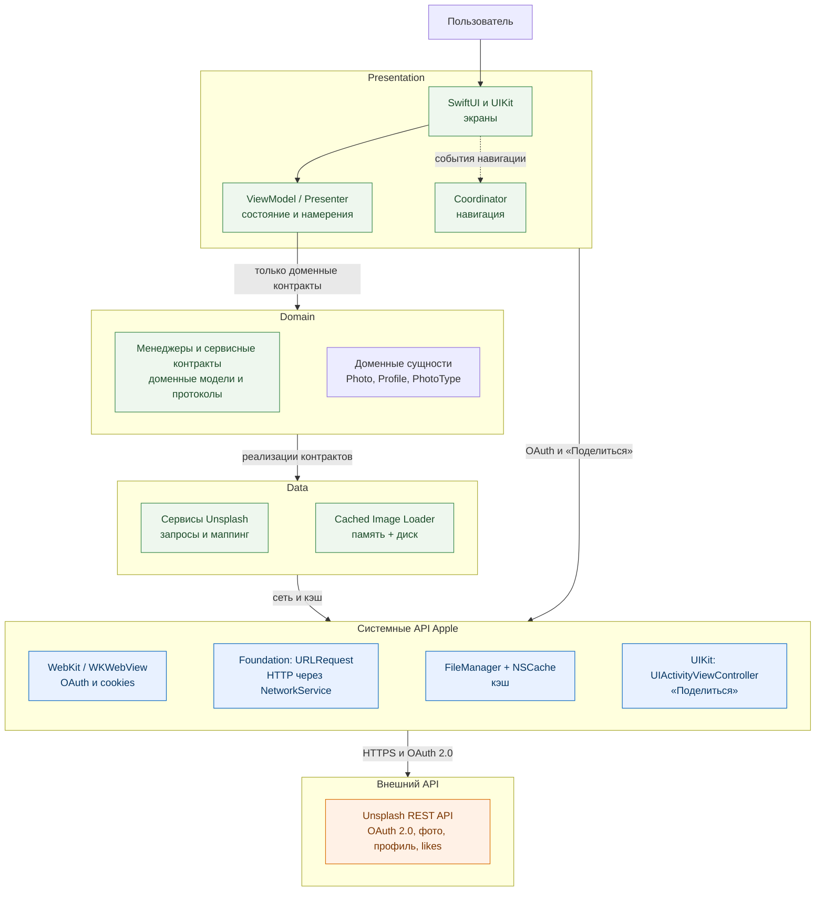

# ImageList

iOS-приложение для просмотра редакционной ленты Unsplash, управления избранными фотографиями и просмотра собственного профиля. В основе интерфейса — SwiftUI, интегрированный с UIKit: UIKit отвечает за жизненный цикл приложения, навигацию, веб-авторизацию и полноэкранный просмотр изображения.

## Main Features

- OAuth 2.0-авторизация через Unsplash в защищённом веб-представлении.
- Бесконечная лента фотографий с pull-to-refresh, постраничной загрузкой и обработкой ошибок.
- Добавление и удаление фотографий из избранного; счётчик избранного синхронизируется с профилем.
- Профиль пользователя с аватаром, данными аккаунта и личной лентой избранных.
- Полноэкранный просмотр с масштабированием, перемещением и системным меню «Поделиться».
- Гибридный кэш изображений в памяти и на диске, предотвращающий повторные загрузки.

## Архитектура системы

Проект использует **слоистую MVVM-архитектуру** с **Coordinator** для навигации и **Dependency Injection** через Swinject. Границы между слоями построены на протоколах: UI зависит от абстракций Domain, а конкретная работа с сетью и кэшем остаётся в Data.

| Слой / модуль | Назначение |
| --- | --- |
| **Application** | Собирает зависимости в composition root, запускает приложение и координирует сценарии авторизации, таб-бар и переход к деталям. |
| **UI** | SwiftUI-экраны и UIKit-контроллеры отображают состояние, передавая пользовательские намерения в ViewModel или Presenter. |
| **Presentation** | ViewModel управляют состояниями загрузки, ошибками, пагинацией и действиями пользователя; Presenter обслуживает полноэкранный UIKit-экран. |
| **Domain** | Содержит модели, протоколы сервисов и бизнес-правила списка и избранного без зависимости от UI и сети. |
| **Data** | Реализует доменные сервисы: формирует запросы к Unsplash, преобразует ответы и управляет кэшем изображений. |
| **Infrastructure** | Предоставляет HTTP-клиент, безопасное хранение сессии, файловое хранилище и сторонние библиотеки, скрытые за протоколами. |

## Data Flow & API

### Как данные проходят через приложение

Пользовательское действие попадает из экрана в ViewModel или Presenter. Они взаимодействуют только с Domain через менеджеры и сервисные протоколы; Data-слой реализует эти контракты, формирует REST-запрос к Unsplash и сначала проверяет изображения в гибридном кэше.

Полученные данные преобразуются в состояние экрана и отображаются в SwiftUI либо UIKit. OAuth проходит через `WKWebView`: код авторизации обменивается на токен, сессия сохраняется инфраструктурным слоем, после чего Coordinator открывает основное таб-приложение.

## Технологии

- Swift, SwiftUI и UIKit
- WebKit, Foundation, FileManager, NSCache
- Swift Concurrency и Combine
- Unsplash REST API / OAuth 2.0
- Swinject, NetworkService, HybridCache и AsyncExtensions
